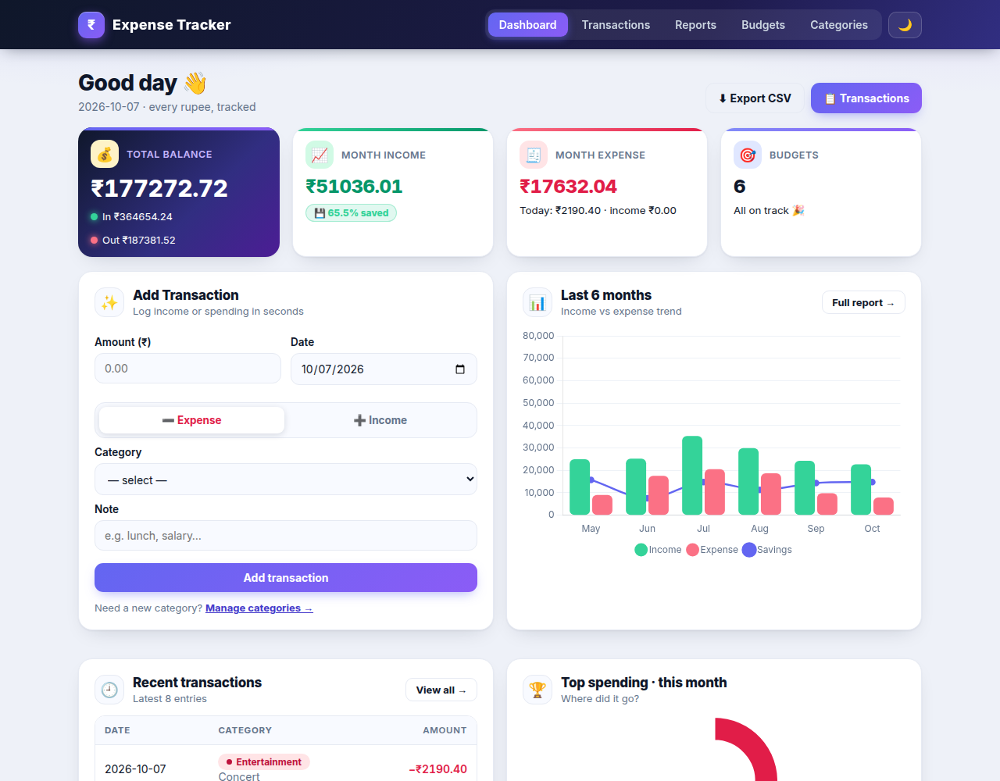
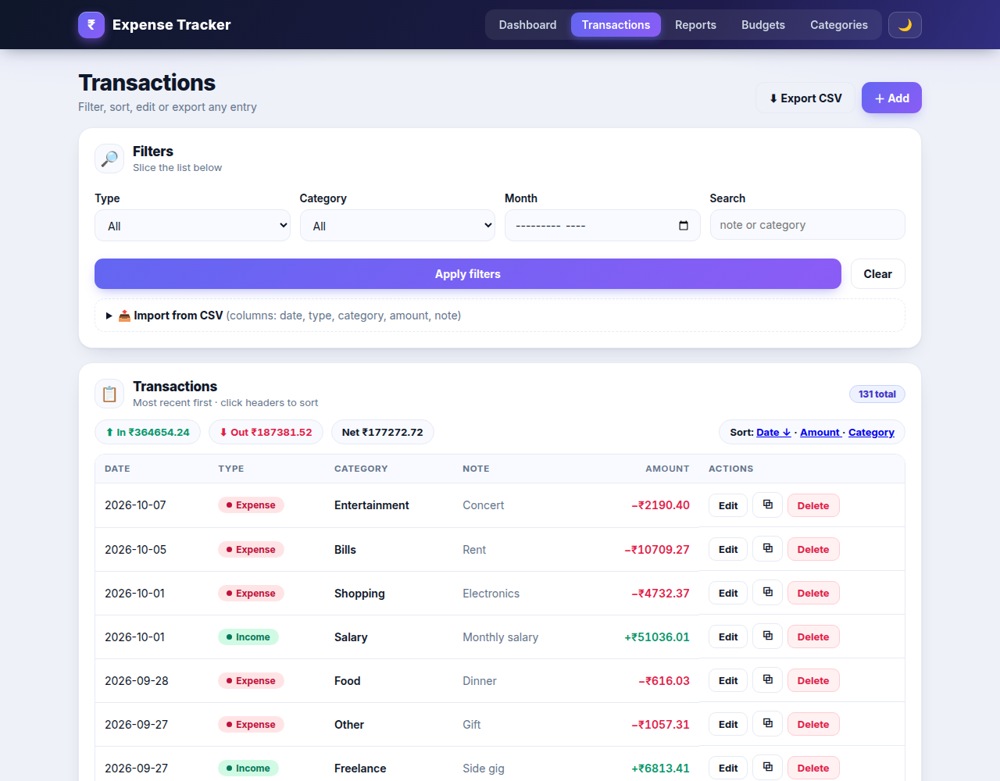
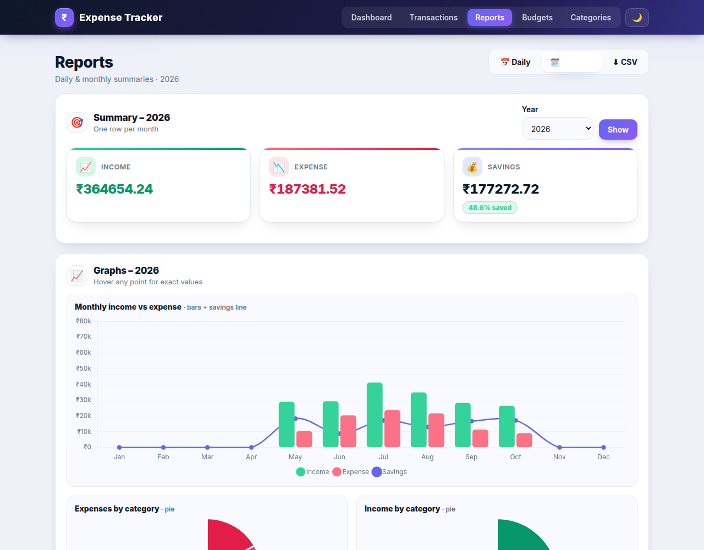
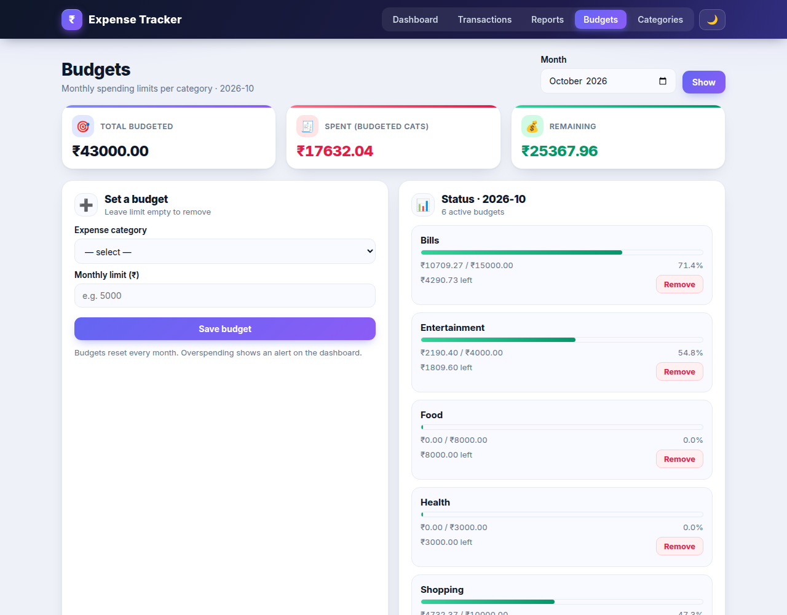

# Expense Tracker 💰

Track income, expenses, budgets and reports — a lightweight Flask + SQLite web app with dark mode and charts.



## Features

- **Dashboard** — balance, monthly stats, savings rate, 6-month trend chart, top-spending breakdown, recent transactions, budget alerts
- **Transactions** — filter by type / category / month / search, sort, paginate, edit, duplicate, delete
- **CSV** — export (respects filters) and import (`date,type,category,amount,note`; categories auto-created)
- **Budgets** — monthly limits per category with progress bars and over-budget alerts
- **Reports** — daily and monthly views with income / expense / savings charts
- **Extras** — dark mode, category management, JSON API (`/api/summary`, `/api/transactions`), health check (`/healthz`)

## Quickstart

```bash
pip install -r requirements.txt
python seed_demo.py  # optional demo data (~130 transactions + budgets)
python app.py        # open http://127.0.0.1:5000
```

Copy `.env.example` to `.env` to set `SECRET_KEY` (required in production) and `CURRENCY_SYMBOL`.

## Screenshots

| Transactions | Reports | Budgets |
|---|---|---|
|  |  |  |

## Docker

```bash
docker compose up --build -d   # http://127.0.0.1:5000
```

Data persists in the `exptracker-data` named volume (`/data/expenses.db`
in the container) across restarts, rebuilds and `docker compose down`.
Only `docker compose down -v` deletes it.

```bash
# plain docker run with the same persistence:
docker build -t exptracker .
docker run -d -p 5000:5000 -v exptracker-data:/data --env-file .env exptracker
# backup / restore:
docker run --rm -v exptracker-data:/data -v "$PWD":/backup busybox tar czf /backup/exptracker-backup.tgz /data
docker run --rm -v exptracker-data:/data -v "$PWD":/backup busybox tar xzf /backup/exptracker-backup.tgz -C /
```

## Config

| Variable | Default | Description |
|---|---|---|
| `SECRET_KEY` | dev default | Flask sessions — **always set in production** |
| `EXPENSE_DB` | `expenses.db` | SQLite file path |
| `CURRENCY_SYMBOL` | `₹` | Currency symbol in UI and CSV |
| `PORT` | `5000` | Dev server port (`python app.py`) |

## Tests & structure

```bash
python3 -m pytest -q
```

```
app.py            Flask app, SQLite logic, JSON API
templates/        dashboard, transactions, budgets, categories, reports, error pages
static/           style.css (light/dark theme), app.js (theme toggle, forms)
expenses.sql      schema: categories, transactions, budgets
seed_demo.py      demo data generator
tests/            pytest suite
screenshots/      README screenshots
```

Schema: `categories(id, name, type)` · `transactions(id, amount, type, category_id, date, note)` · `budgets(id, category_id, monthly_limit)`
